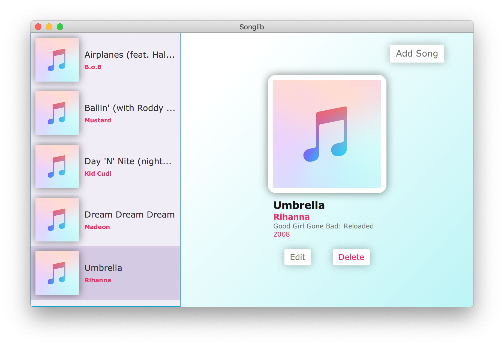

# Songlib
A simple song library for CS-213 Software Methodology created usign JavaFX.

## Features
* Clean & responsive UI
* Add songs
* Edit songs
* Delete songs
* Sorts songs alphabetically by name then by artist
* Changes are saved locally using JSON
